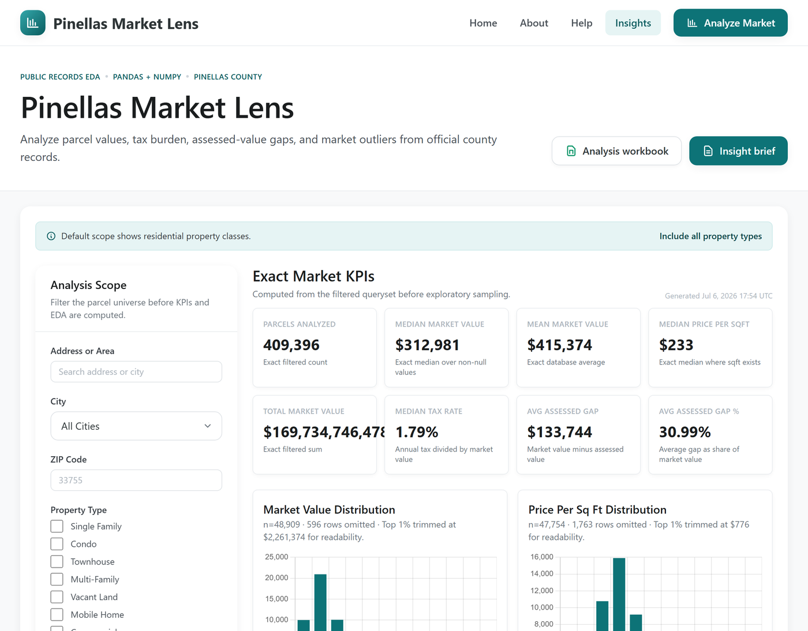
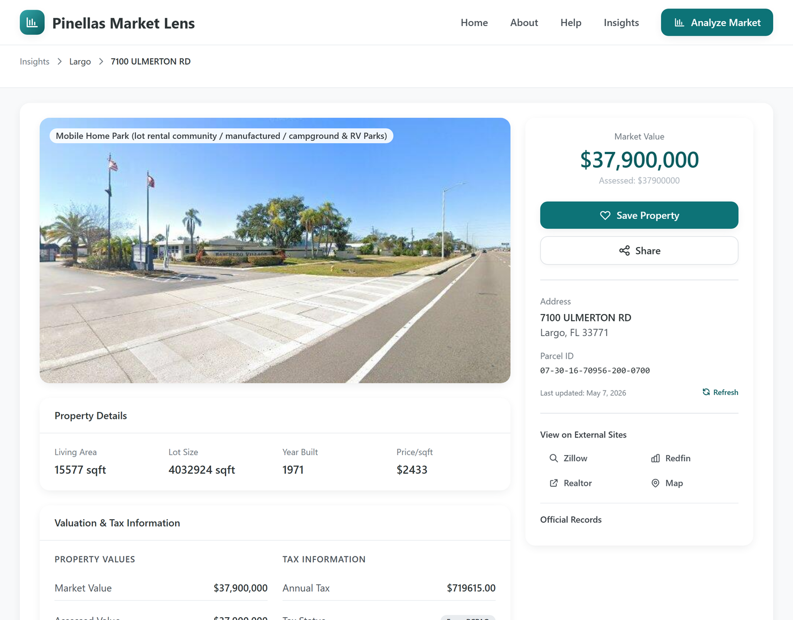
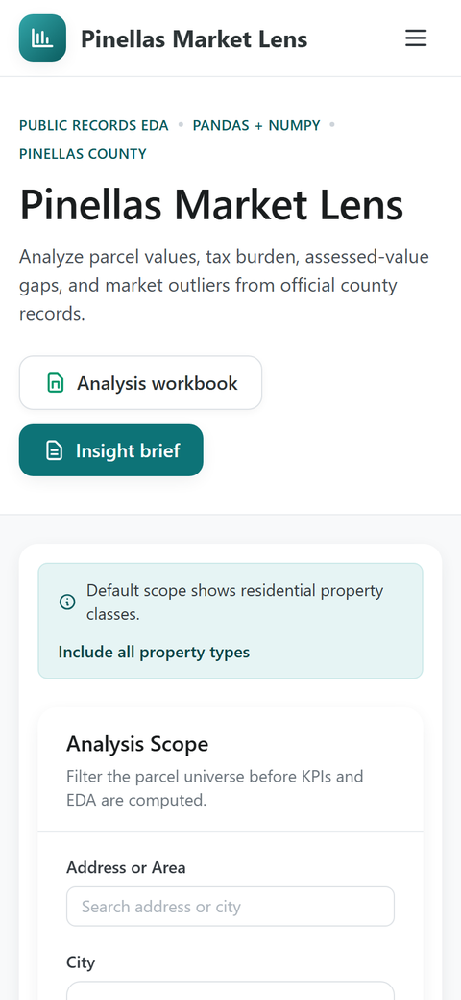
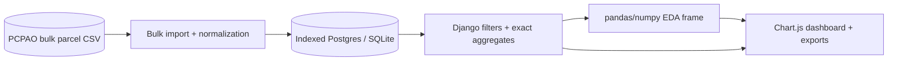

# Pinellas Market Lens

[](https://github.com/pgil256/home_finder/actions/workflows/ci.yml)


> **Live:** [homefinder.patbuilds.dev](https://homefinder.patbuilds.dev)

Pinellas Market Lens is a data-science dashboard for exploring Pinellas County, Florida parcel records. It pivots the original property-search app into an analytics-first portfolio project: official public records are ingested, cleaned, indexed, filtered, and analyzed with pandas/numpy to expose market KPIs, distributions, segment comparisons, tax burden, assessed-value gaps, and auditable outliers.

> The repository is still named `home_finder` from its original property-search incarnation; it was rebuilt around the analytics workflow described below.

## Screenshots

The market-insights dashboard — exact KPIs over 400k+ parcels, with pandas/numpy distributions, city/type segments, and auditable outliers:



A parcel drilldown (here a high-value outlier surfaced by the dashboard) and the responsive mobile layout:

<p align="center">
  
  &nbsp;
  
</p>

## What It Shows

| Route | Purpose |
|---|---|
| `/` and `/insights/` | Main market insights dashboard with filters, KPIs, charts, segment tables, methodology, and outlier drilldowns |
| `/analytics/` | Filter-builder form that redirects into `/insights/` |
| `/analytics/dashboard/` | Legacy URL alias that renders the same insights dashboard |
| `/analytics/property/<parcel_id>/` | Parcel drilldown used to audit sample parcels and outlier rows |
| `/analytics/download/excel/` | Analysis workbook: Overview, City Segments, Property Type Segments, Outliers, Sample Parcels, Methodology |
| `/analytics/download/pdf/` | PDF insight brief with filters, exact KPIs, takeaways, segments, outliers, and methodology |

## Data + Analysis Flow



The production architecture keeps the app cheap and understandable: Vercel serves Django, Neon stores the indexed parcel table, and GitHub Actions refreshes the public-record data. The interesting data-science layer is now visible in the product instead of hidden inside a download.

### Design decisions

- **Exact DB aggregates + capped pandas frames.** Headline KPIs (counts, medians, sums, tax rates) are exact database aggregates over the full filtered queryset, so the numbers are always right. The pandas/numpy layer that powers distributions, segments, and scatter plots reads a capped analysis frame (≤50k rows) — enough for representative EDA without pulling ~400k rows into a serverless function on every request.
- **Monthly bulk CSV import over live scraping.** The original app scraped PCPAO per search (Selenium, ~15 rows, 15–30s, often zero results). Importing the county's public bulk CSV once a month turns every search into a sub-second indexed query over complete data and removes Chrome/Selenium from the request path. The old per-parcel scrape survives only as an on-demand refresh.
- **Vercel serverless + Neon Postgres.** Vercel runs Django with no servers to manage; Neon is a serverless Postgres that idles to zero between requests. The full dataset (~150 MB / ~400k parcels) fits under Neon's free storage, so the project is effectively free to run.
- **DatabaseCache over Redis.** The only thing needing a cache is the per-parcel refresh rate limit. A database-backed cache table needs no extra service, survives serverless cold starts, and fails open — not worth standing up Redis for one rate-limit key.
- **GitHub Actions for the data refresh.** The import runs 10–20 minutes, well past Vercel's function timeout, so a monthly GitHub Actions cron runs it against Neon instead — free, no extra infrastructure, and duration doesn't matter for a one-shot batch.

## Interesting Bits

- Exact database KPIs: parcel count, median/mean market value, median price per square foot, total market value, median tax rate, and assessed-vs-market gap.
- pandas/numpy exploratory analysis: percentiles, histograms, city/type segment summaries, build-era trend lines, market-vs-assessed scatter samples, and outlier rankings.
- Auditable outliers: high-value IQR outliers, largest assessed gaps, and highest tax-burden parcels link back to parcel drilldowns.
- Honest methodology: v1 does not claim predictive valuation because the public dataset lacks MLS sale prices and reliable bedrooms/bathrooms coverage.
- Production constraints: interactive EDA is capped for responsiveness, while headline KPIs remain exact database aggregates.
- On-demand freshness: the full dataset refreshes monthly via GitHub Actions, and any single parcel can be re-pulled from the County Property Appraiser on demand — rate-limited to one refresh per parcel per minute via the database cache.

## Tech Stack

| Layer | Choice |
|---|---|
| Web | Django 5.2 on Vercel |
| Database | Neon Postgres in production, SQLite locally |
| Analysis | pandas, numpy, Django ORM aggregates |
| Frontend | Django templates, Tailwind CSS, Chart.js, vanilla JS |
| Exports | openpyxl and ReportLab |
| Data refresh | GitHub Actions + bulk CSV import |
| Tests | pytest, pytest-django, Jest, Playwright/httpx smoke tests |

## Quick Start

```bash
git clone https://github.com/pgil256/home_finder.git
cd home_finder

python -m venv venv
.\venv\Scripts\Activate.ps1
pip install -r requirements.txt

copy .env.example .env
python manage.py migrate
python manage.py import_pcpao_data --file apps/WebScraper/fixtures/sample_pcpao_data.csv

npm install
npm run build

python manage.py runserver
```

Then open [http://127.0.0.1:8000/insights/](http://127.0.0.1:8000/insights/).

## Development

```bash
make lint
make test
npm test
npm run build
pytest tests/e2e/test_smoke.py
pytest tests/e2e/browser/
```

## Limitations

- PCPAO records are public assessment records, not MLS transactions.
- Bedrooms and bathrooms are not reliable in the bulk public dataset, so they are not used as core market signals.
- The dashboard is exploratory analysis, not investment advice or a predictive appraisal model.
- Interactive pandas/numpy charts are capped to keep serverless responses responsive; exact headline KPIs are computed against the full filtered queryset.
- Street View support remains available for parcel drilldowns when a Google API key is configured, but imagery is not central to the analytics workflow.

## License

MIT. See [LICENSE](LICENSE).
