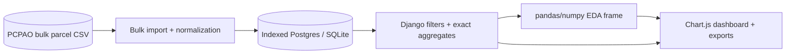

# Pinellas Market Lens

[](https://github.com/pgil256/home_finder/actions/workflows/ci.yml)


> **Live:** [homefinder.patbuilds.dev](https://homefinder.patbuilds.dev)

Pinellas Market Lens is a data-science dashboard for exploring Pinellas County, Florida parcel records. It pivots the original property-search app into an analytics-first portfolio project: official public records are ingested, cleaned, indexed, filtered, and analyzed with pandas/numpy to expose market KPIs, distributions, segment comparisons, tax burden, assessed-value gaps, and auditable outliers.

## What It Shows

| Route | Purpose |
|---|---|
| `/` and `/insights/` | Main market insights dashboard with filters, KPIs, charts, segment tables, methodology, and outlier drilldowns |
| `/analytics/` | Filter-builder form that redirects into `/insights/` |
| `/analytics/dashboard/` | Legacy URL alias that renders the same insights dashboard |
| `/analytics/property/<parcel_id>/` | Parcel drilldown used to audit sample parcels and outlier rows |
| `/analytics/download/excel/` | Analysis workbook: Overview, City Segments, Property Type Segments, Outliers, Sample Parcels, Methodology |
| `/analytics/download/pdf/` | PDF insight brief with filters, exact KPIs, takeaways, segments, outliers, and methodology |

## Data + Analysis Flow



The production architecture keeps the app cheap and understandable: Vercel serves Django, Neon stores the indexed parcel table, and GitHub Actions refreshes the public-record data. The interesting data-science layer is now visible in the product instead of hidden inside a download.

## Interesting Bits

- Exact database KPIs: parcel count, median/mean market value, median price per square foot, total market value, median tax rate, and assessed-vs-market gap.
- pandas/numpy exploratory analysis: percentiles, histograms, city/type segment summaries, build-era trend lines, market-vs-assessed scatter samples, and outlier rankings.
- Auditable outliers: high-value IQR outliers, largest assessed gaps, and highest tax-burden parcels link back to parcel drilldowns.
- Honest methodology: v1 does not claim predictive valuation because the public dataset lacks MLS sale prices and reliable bedrooms/bathrooms coverage.
- Production constraints: interactive EDA is capped for responsiveness, while headline KPIs remain exact database aggregates.

## Tech Stack

| Layer | Choice |
|---|---|
| Web | Django 5.2 on Vercel |
| Database | Neon Postgres in production, SQLite locally |
| Analysis | pandas, numpy, Django ORM aggregates |
| Frontend | Django templates, Tailwind CSS, Chart.js, vanilla JS |
| Exports | openpyxl and ReportLab |
| Data refresh | GitHub Actions + bulk CSV import |
| Tests | pytest, pytest-django, Jest, Playwright/httpx smoke tests |

## Quick Start

```bash
git clone https://github.com/pgil256/home_finder.git
cd home_finder

python -m venv venv
.\venv\Scripts\Activate.ps1
pip install -r requirements.txt

copy .env.example .env
python manage.py migrate
python manage.py import_pcpao_data --file apps/WebScraper/fixtures/sample_pcpao_data.csv

npm install
npm run build

python manage.py runserver
```

Then open [http://127.0.0.1:8000/insights/](http://127.0.0.1:8000/insights/).

## Development

```bash
make lint
make test
npm test
npm run build
pytest tests/e2e/test_smoke.py
pytest tests/e2e/browser/
```

## Limitations

- PCPAO records are public assessment records, not MLS transactions.
- Bedrooms and bathrooms are not reliable in the bulk public dataset, so they are not used as core market signals.
- The dashboard is exploratory analysis, not investment advice or a predictive appraisal model.
- Interactive pandas/numpy charts are capped to keep serverless responses responsive; exact headline KPIs are computed against the full filtered queryset.
- Street View support remains available for parcel drilldowns when a Google API key is configured, but imagery is not central to the analytics workflow.

## License

MIT. See [LICENSE](LICENSE).
