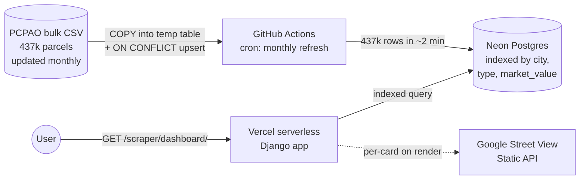

# Pinellas Property Finder

[](https://github.com/pgil256/home_finder/actions/workflows/ci.yml)


> **Live:** [homefinder.patbuilds.dev](https://homefinder.patbuilds.dev)

A searchable index of every property in Pinellas County, Florida —
437,000+ parcels from the official County Property Appraiser dataset
with monthly refreshes. Filter by city, ZIP, price, year built, square
footage, or property type. Export the filtered slice as a market-analysis
spreadsheet or PDF report.

Built and deployed for $0/month on Vercel + Neon Postgres free tiers.

---

## Architecture



Two services, both free: **Vercel** for the Django web layer,
**Neon Postgres** for indexed search. No worker, no broker, no caching
layer needed — every search is an indexed `WHERE` query that returns
in <200ms even against the full 437k-row dataset.

This wasn't the original architecture. The repo started as a Selenium
scraper with a Celery + Redis task pipeline, which broke when the Redis
endpoint went down in production. The pivot to **bulk-ingest-once,
serve-from-DB** removed both subsystems and made search instant. Full
story in [`docs/SESSION_NOTES.md`](docs/SESSION_NOTES.md) and
[`docs/plans/2026-05-07-search-architecture-pivot.md`](docs/plans/2026-05-07-search-architecture-pivot.md).

---

## What it does

| Page | What you can do |
|---|---|
| `/` | Landing page with the value prop |
| `/scraper/` | Search form — filter by city, ZIP, price range, type, year built, square footage |
| `/scraper/dashboard/` | Browse results in a grid or list view, with filter chips and pagination |
| `/scraper/property/<parcel_id>/` | Per-property detail with full Property Appraiser data and "similar properties" |
| `/scraper/download/excel/` | Multi-sheet workbook: Summary stats, Listings, By Property Type, By City — respects current filters |
| `/scraper/download/pdf/` | PDF report with filter context, headline stats, top-200 listings table, and 6 market analysis charts |

---

## Tech stack

| Layer | Choice | Why |
|---|---|---|
| Web | Django 5.0 on Vercel serverless | Free tier, 60s function budget, auto-deploys on push |
| Database | Postgres on Neon | Free 0.5GB, indexed scans, supports `COPY` for bulk ingest |
| Frontend | Tailwind CSS + Webpack + vanilla JS | No SPA framework needed — Django templates render fast |
| Images | Google Street View Static API | Per-card image, falls back to placeholder when no API key |
| Data refresh | GitHub Actions cron | Monthly `manage.py import_pcpao_data` against Neon |
| E2E tests | Playwright + pytest + httpx | Smoke against prod every 4h, full suite on demand |
| CI | GitHub Actions | ruff + pytest + JS tests + frontend build |

---

## Quick start

```bash
git clone https://github.com/pgil256/home_finder.git
cd home_finder

# Python
python3 -m venv venv && source venv/bin/activate
pip install -r requirements.txt

# Required env vars (see .env.example)
cp .env.example .env
#   SECRET_KEY=...
#   DATABASE_URL=postgresql://...    # local Postgres or Neon
#   GOOGLE_STREET_VIEW_API_KEY=...   # optional; cards fall back to placeholder

# Schema + cache table
python3 manage.py migrate
python3 manage.py createcachetable
python3 manage.py load_pinellas_data

# Bulk-load 437k parcels (one-shot, ~2 min via COPY)
python3 scripts/bulk_import_copy.py

# Frontend assets
npm install && npm run build

# Run
python3 manage.py runserver
```

---

## Development

```bash
make help            # show all targets
make dev             # dev server + frontend watcher
make lint            # ruff + ESLint
make test            # Python unit/integration tests
make test-js         # JS unit tests
make e2e-smoke       # Read-only smoke tests against prod
make e2e-functional  # Form-submit tests (writes to DB; needs E2E_DATABASE_URL)
make e2e-browser     # Playwright browser tests
```

---

## Honest limitations

A portfolio app should be honest about what it doesn't do.

- **No bedrooms / bathrooms.** PCPAO doesn't publish either field in any
  of their bulk tables (`RP_PROPERTY_INFO`, `RP_BUILDING`,
  `RP_STRUCTURAL_ELEMENTS`) and the live property pages don't show them
  either. Adding those filters would require an MLS feed (paid),
  contradicting the $0/month constraint.
- **Tax data is annual, not real-time.** PCPAO refreshes their bulk
  files monthly; we mirror that cadence. Tax bills update yearly with
  the November billing cycle.
- **Street View images cost the API key owner.** The `street_view_url`
  template tag returns empty when `GOOGLE_STREET_VIEW_API_KEY` isn't
  set, so the dashboard falls back to a clean placeholder. Image loads
  bill at ~$7/1000 to whoever owns the key.
- **Search caps at the Vercel function timeout.** Indexed queries
  return in <200ms even for the worst case, so this isn't a real
  ceiling, but anything that scans the table (sort by an unindexed
  field) would be subject to the 60s budget.

---

## Project layout

```
home_finder/
├── apps/
│   ├── WebScraper/                  Core: search, dashboard, exports
│   │   ├── models.py                PropertyListing
│   │   ├── views.py                 Thin views → services
│   │   ├── services/
│   │   │   ├── filtering.py         Dashboard query logic, residential default
│   │   │   ├── exports.py           Excel + PDF market analysis
│   │   │   ├── pcpao_importer.py    Bulk CSV ingest (COPY-based)
│   │   │   └── street_view.py       Google Street View URL builder
│   │   ├── tasks/                   Per-property scrape (kept for refresh)
│   │   ├── templatetags/            street_view_url, format_price helpers
│   │   └── management/commands/     import_pcpao_data
│   ├── KeywordSelection/            Pinellas city/ZIP fixtures
│   └── Pages/                       Landing, About, Help
├── scripts/
│   └── bulk_import_copy.py          Fast one-shot loader (PostgreSQL COPY)
├── tests/
│   └── e2e/                         Playwright + httpx smoke/functional/browser
├── templates/                       Django templates (Tailwind)
├── docs/
│   ├── SESSION_NOTES.md             Architecture pivot story
│   └── plans/                       Design docs by date
├── .github/workflows/
│   ├── ci.yml                       lint + tests on push
│   ├── e2e.yml                      smoke against prod every 4h
│   └── refresh-data.yml             monthly bulk import to Neon
└── vercel.json                      framework: django
```

---

## License

MIT — see [LICENSE](LICENSE).
