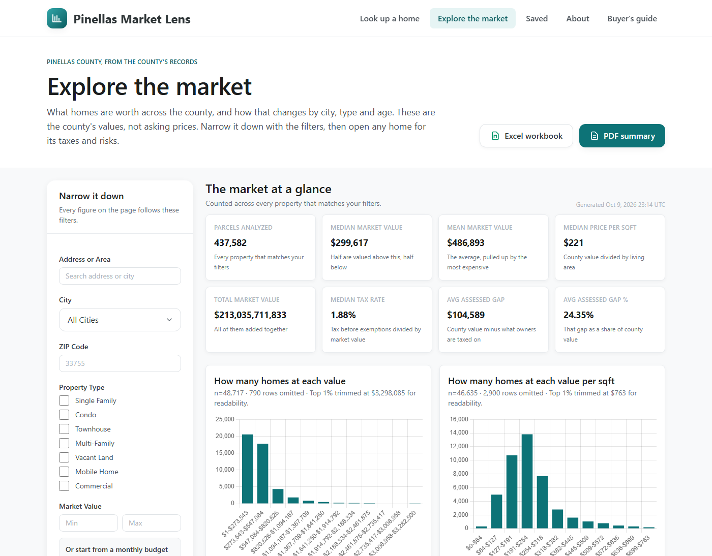
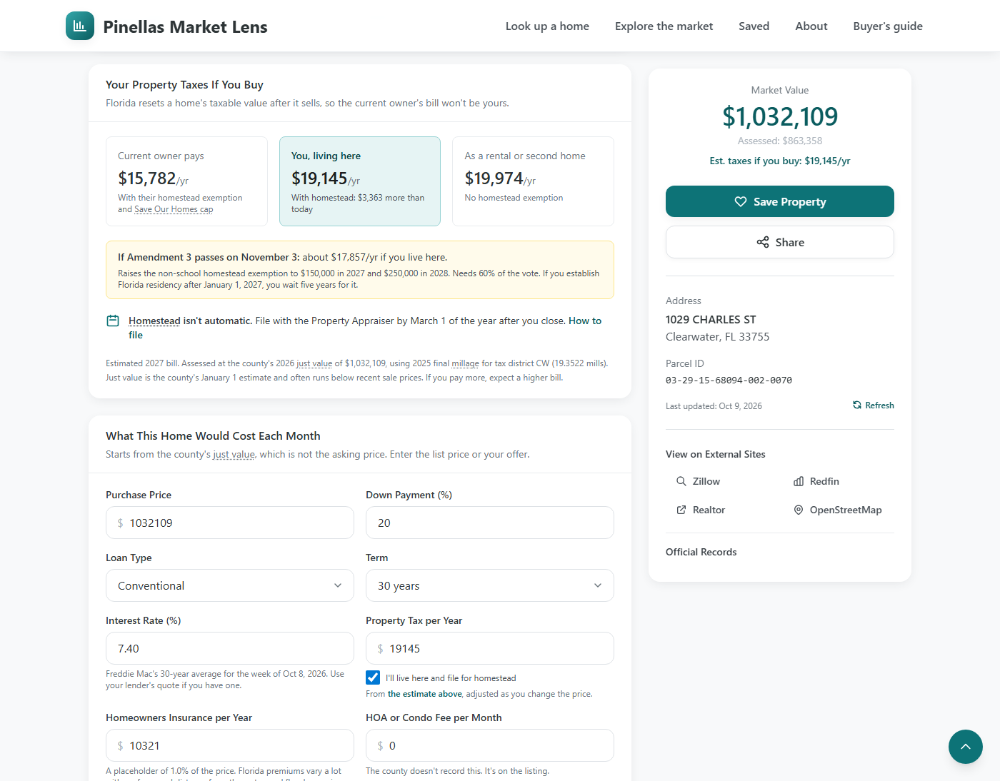
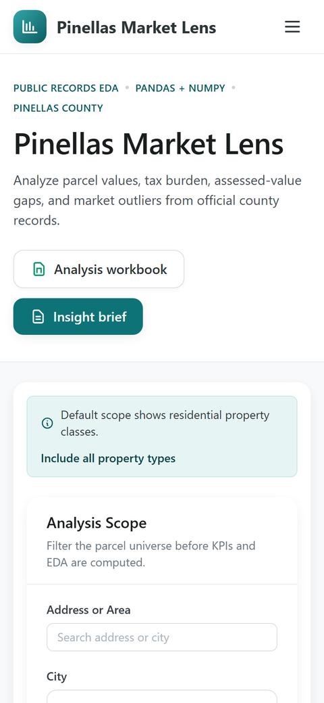
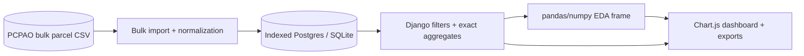

# Pinellas Market Lens

[](https://github.com/pgil256/home_finder/actions/workflows/ci.yml)


> **Live:** [homefinder.patbuilds.dev](https://homefinder.patbuilds.dev)
>
> The same Vercel project also answers at [homefinder-jet.vercel.app](https://homefinder-jet.vercel.app), which is the URL a push to `main` deploys to. The custom domain is a Cloudflare-proxied alias for it; if the two ever disagree (compare `/api/status/` on each), the domain is pointed at the wrong Vercel project or database. The daily smoke test checks the custom domain and opens a "Production smoke failed" issue when it fails.

Pinellas Market Lens answers a home buyer's question about any Pinellas County, Florida property: what will this home really cost me, and what's the catch? Type the address from a listing to see the property taxes a new owner would pay (not the seller's capped bill), what the home and similar homes nearby last sold for, and the risk flags on the county's record. Behind it, official public records are ingested, cleaned, indexed, filtered, and analyzed with pandas/numpy, and a market dashboard exposes KPIs, distributions, segment comparisons, tax burden, assessed-value gaps, and auditable outliers.

> The repository is still named `home_finder` from its original property-search incarnation; it was rebuilt around the analytics workflow described below.

## Screenshots

The market-insights dashboard — exact KPIs over 437,000+ parcels, with pandas/numpy distributions, city/type segments, and auditable outliers:



A parcel page (the new-owner tax estimate and monthly cost) and the responsive mobile layout:

<p align="center">
  
  &nbsp;
  
</p>

## What It Shows

| Route | Purpose |
|---|---|
| `/` | Home page that leads with the address lookup box |
| `/lookup/?q=<address or parcel ID>` | Address lookup: up to 25 matching parcels with just value and estimated new-owner tax; a parcel ID redirects to its parcel page |
| `/lookup/suggest/?q=<start of an address>` | JSON for the lookup box's typeahead: up to 8 addresses that start with what has been typed (3 characters or more), CDN-cached and closed to crawlers |
| `/insights/` | Main market insights dashboard with filters, KPIs, charts, segment tables, methodology, and outlier drilldowns |
| `/analytics/` | Filter-builder form that redirects into `/insights/` |
| `/analytics/dashboard/` | Legacy URL that redirects to `/insights/` |
| `/analytics/property/<parcel_id>/` | Parcel page: new-owner tax, recorded sales and comparable sales, monthly cost and risk flags, including the year of the last roof permit and the FEMA flood zone, plus the ZIP code's flood-claim history, and a map with FEMA's flood zones as an overlay. Also the drilldown for sample parcels and outlier rows |
| `/analytics/compare/?ids=<parcel IDs>` | Saved homes side by side (up to 6): value, new-owner tax, monthly cost and risk flags. The list lives in the browser's `localStorage`; the header's Saved link builds the URL |
| `/analytics/download/excel/` | Analysis workbook: Overview, City Segments, Property Type Segments, Outliers, Sample Parcels, Methodology |
| `/analytics/download/pdf/` | PDF insight brief with filters, exact KPIs, takeaways, segments, outliers, and methodology |

## Data + Analysis Flow


```mermaid
flowchart LR
    PCPAO[(PCPAO bulk parcel CSV)]
    IMPORT[Bulk import + normalization]
    DB[(Indexed Postgres / SQLite)]
    DJANGO[Django filters + exact aggregates]
    PANDAS[pandas/numpy EDA frame]
    UI[Chart.js dashboard + exports]

    PCPAO --> IMPORT --> DB --> DJANGO --> PANDAS --> UI
    DJANGO --> UI
```

The production architecture keeps the app cheap and understandable: Vercel serves Django, Neon stores the indexed parcel table, and GitHub Actions refreshes the public-record data. The interesting data-science layer is now visible in the product instead of hidden inside a download.

### Design decisions

- **Exact DB aggregates + capped pandas frames.** Headline KPIs (counts, medians, sums, tax rates) are exact database aggregates over the full filtered queryset, so the numbers are always right. The pandas/numpy layer that powers distributions, segments, and scatter plots reads a capped analysis frame (≤50k rows) — enough for representative EDA without pulling ~437k rows into a serverless function on every request.
- **Monthly bulk CSV import over live scraping.** The original app scraped PCPAO per search (Selenium, ~15 rows, 15–30s, often zero results). Importing the county's public bulk CSV once a month turns every search into a sub-second indexed query over complete data and removes Chrome/Selenium from the request path. The old per-parcel scrape survives only as an on-demand refresh.
- **No Google or paid API dependency.** Search and analytics use the county's public dataset, parcel photos come directly from the Property Appraiser when available, the parcel map is MapLibre GL with OpenFreeMap tiles (free, no key, loaded by the visitor's browser), and the interface uses system fonts and bundled SVG icons.
- **Vercel serverless + Neon Postgres.** Vercel runs Django with no servers to manage; Neon is a serverless Postgres that idles to zero between requests. The full dataset (~150 MB / ~437k parcels) fits under Neon's free storage, so the project is effectively free to run.
- **DatabaseCache over Redis.** The only things needing a cache are the per-parcel refresh and per-IP export rate limits. A database-backed cache table needs no extra service, survives serverless cold starts, and fails open — not worth standing up Redis for a couple of rate-limit keys.
- **GitHub Actions for the data refresh.** The import runs 10–20 minutes, well past Vercel's function timeout, so a monthly GitHub Actions cron runs it against Neon instead — free, no extra infrastructure, and duration doesn't matter for a one-shot batch.

## Interesting Bits

- Exact database KPIs: parcel count, median/mean market value, median price per square foot, total market value, median tax rate, and assessed-vs-market gap.
- pandas/numpy exploratory analysis: percentiles, histograms, city/type segment summaries, build-era trend lines, market-vs-assessed scatter samples, and outlier rankings.
- Auditable outliers: high-value IQR outliers, largest assessed gaps, and highest tax-burden parcels link back to parcel drilldowns.
- Honest methodology: no predictive valuation. Parcel pages show recorded qualified sales and a median price per square foot from similar nearby sales, with the count and range, and hide it when fewer than three homes sold. The dataset has no listing prices and no reliable bedrooms/bathrooms coverage.
- Production constraints: interactive EDA is capped for responsiveness, while headline KPIs remain exact database aggregates.
- On-demand freshness: the full dataset refreshes monthly via GitHub Actions, and any single parcel can be re-pulled from the County Property Appraiser on demand — rate-limited to one refresh per parcel per minute via the database cache.

## Tech Stack

| Layer | Choice |
|---|---|
| Web | Django 5.2 on Vercel |
| Database | Neon Postgres in production, SQLite locally |
| Analysis | pandas, numpy, Django ORM aggregates |
| Frontend | Django templates, Tailwind CSS, Chart.js, vanilla JS |
| Exports | openpyxl and ReportLab |
| Data refresh | GitHub Actions + bulk CSV import |
| Tests | pytest, pytest-django, Jest, Playwright/httpx smoke tests |

## Quick Start

```bash
git clone https://github.com/pgil256/home_finder.git
cd home_finder

python -m venv venv
.\venv\Scripts\Activate.ps1
pip install -r requirements.txt

copy .env.example .env
python manage.py migrate
python manage.py import_pcpao_data --file apps/analytics/fixtures/sample_pcpao_data.csv --millage-file apps/analytics/fixtures/sample_millage_rates.csv --sales-file apps/analytics/fixtures/sample_sales.csv --permits-file apps/analytics/fixtures/sample_permits.csv

npm install
npm run build

python manage.py runserver
```

Then open [http://127.0.0.1:8000/insights/](http://127.0.0.1:8000/insights/).

## Development

```bash
make lint
make test
npm test
npm run build
pytest tests/e2e/test_smoke.py
pytest tests/e2e/browser/
```

## Limitations

- PCPAO records are public assessment and deed records, not MLS listings. Sale prices are the county's qualified sales since 2021; there are no asking prices, and a sale can take a month or more to appear.
- Comparable sales are a median price per square foot from the same county appraisal neighborhood, not an appraisal. They ignore condition, updates, lot and view, and the 48-parcel sample fixture is too sparse to produce any.
- Roof and heating/air years are the year of the latest county permit of that kind, back to 1997. A permit can be a repair rather than a replacement, and work done without a permit doesn't appear. A missing roof permit is only flagged for houses; condo and townhome roofs usually belong to the association.
- Flood zones come from FEMA's National Flood Hazard Layer, read at the county's map point for each parcel and refreshed quarterly by the "Refresh flood data" workflow, so a building near a zone line can sit in a different zone, and a parcel added since the last refresh has none yet. Flood-claim counts are per ZIP code, which is as fine as FEMA publishes them; they say nothing about one home.
- Bedrooms and bathrooms are not reliable in the bulk public dataset, so they are not used as core market signals.
- The dashboard is exploratory analysis, not investment advice or a predictive appraisal model.
- New-owner tax estimates assess the home at the county's just value with the latest adopted millage. A buyer who pays more than just value, or buys after millage rates change, will see a different bill.
- Interactive pandas/numpy charts are capped to keep serverless responses responsive; exact headline KPIs are computed against the full filtered queryset.

## License

MIT. See [LICENSE](LICENSE).
